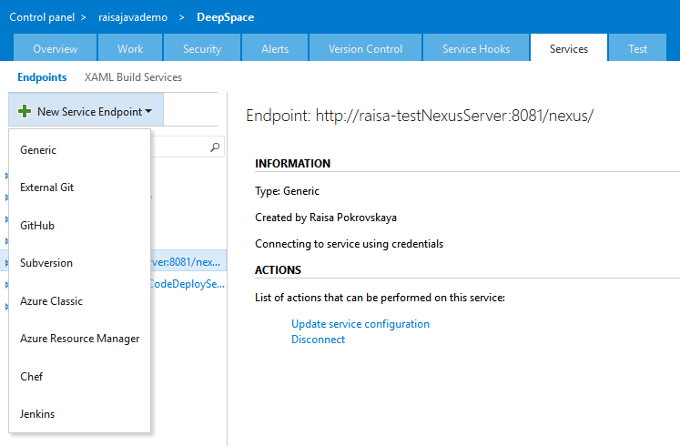
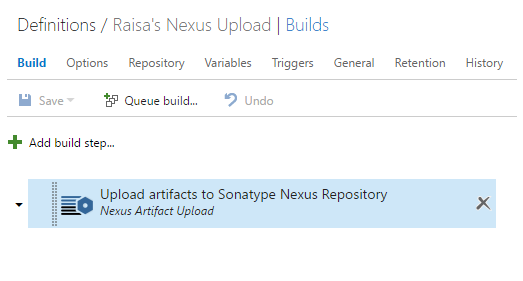

# Integrate with Sonatype Nexus
This extension provides build tasks that enable you to integrate with [Sonatype Nexus](http://www.sonatype.org/nexus/).

## Create a Sonatype Nexus Connection
Create a Generic Service Endpoint and specify your Sonatype Nexus endpoint URL, user name, and password.

## Define your build process
Create a build definition to automate your build process. For detailed instructions on setting up a build definition, check out [this](https://msdn.microsoft.com/library/vs/alm/build/define/create).

Add the Sonatype Nexus Artifact Upload Build task to your build steps.

Specify the input arguments.

## License
The [code](https://github.com/Microsoft/vsts-nexus) is open sourced under the MIT license. We love and encourage community contributions.  