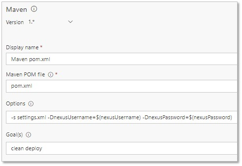
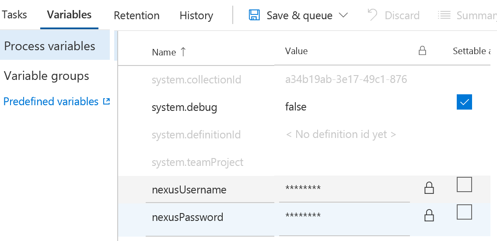

# Integrate with Sonatype Nexus
This extension provides build tasks that enable you to integrate with [Sonatype Nexus](http://www.sonatype.org/nexus/) 2.x. (Sonatype Nexus 3.x is not supported currently.)

## Create a Sonatype Nexus Connection
Create a Generic Service Endpoint and specify your Sonatype Nexus endpoint URL, user name, and password.


## Define your build process
Create a build definition to automate your build process. For detailed instructions on setting up a build definition, check out [this](https://msdn.microsoft.com/library/vs/alm/build/define/create).

Add the Sonatype Nexus Artifact Upload Build task to your build steps.


Specify the input arguments.

7

## License
The [code](https://github.com/Microsoft/vsts-urbancode-deploy) is open sourced under the MIT license. We love and encourage community contributions.

## Build pre-requisites
1. This package requires `node` and `npm`

## To compile, please run:
1. npm update
1. gulp

The vsix package will be produced in `_package`, and it can be uploaded to the Azure DevOps Marketplace for sharing.

## FAQ
### What if I need to work with Sonatype Nexus 3.x?
The best way to upload artifacts into Nexus 3.x is to use Maven publish capabilities.
The quickest way to deploy a file with Maven is described in [https://maven.apache.org/plugins/maven-deploy-plugin/usage.html](https://maven.apache.org/plugins/maven-deploy-plugin/usage.html).
Tell Maven which file to deploy and define the repository you are deploying to in the pom.xml & settings.xml files. 
In your pom.xml file add a section describing your release and snapshot Nexus repositories. E.g.
```
  <repositories>
    <repository>
      <id>teamNexus</id>
      <url>http://public_artifacts_server:8081/nexus/content/repositories/releases</url>
    </repository>
    <repository>
      <id>teamNexus.snapshots</id>
      <url>http://public_artifacts_server:8081/nexus/content/repositories/snapshots</url>
      <releases>
        <enabled>false</enabled>
      </releases>
      <snapshots>
        <enabled>true</enabled>
      </snapshots>
    </repository>
  </repositories>
```
In the settings.xml file specify the credentials that Maven task will use to access Nexus repositories. E.g.
```
<?xml version="1.0" encoding="UTF-8"?>
<settings xmlns="http://maven.apache.org/SETTINGS/1.0.0"
          xmlns:xsi="http://www.w3.org/2001/XMLSchema-instance"
          xsi:schemaLocation="http://maven.apache.org/SETTINGS/1.0.0 http://maven.apache.org/xsd/settings-1.0.0.xsd">
  <servers>
    <server>
      <id>teamNexus</id>
      <username>${nexusUsername}</username>
      <password>${nexusPassword}</password>
    </server>
  </servers>
</settings>
```
Note that the example uses Maven properties for user name and password credentials. 
These properties can be set in the build task in the secure way using secret variables in your Build/Release.
And here’s what the Maven task looks like in the Azure Pipelines build definition to run the ‘clean’ and ‘deploy’ goals of the pom.xml to do the deployment:



`$(nexusUsername)` and `$(nexusPassword)` are secret Azure Pipelines build variables, which should be defined in the Variables section of the build definition:


